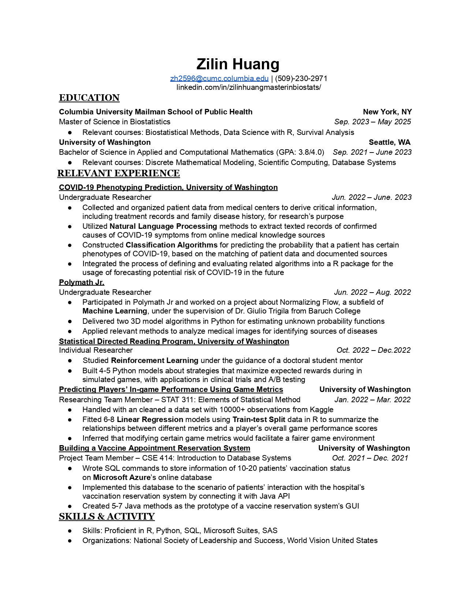

I have attached my resume in this page as a reference:

From October 2020 to June 2021, I worked as a part-time mathematics tutor at Green River Community College (abbreviated as _GRCC_), under the supervision of the college's mathematics learning center. My responsibilities include:

• Tutored students in calculus and linear algebra subjects regarding the homework questions to improve their their problem-solving skills

• Instructed groups of 3 – 5 students each quarter to achieve improved overall comprehensions of certain math concepts

• Discussed with the coordinator and other colleagues weekly about measures to effectively interact with students through online platforms

I ended my work experience due to end of study at Green River Community College after earning an Associate of Arts in Computer Science.