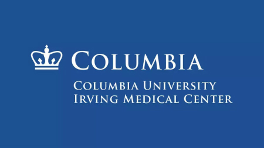

Hello everyone. This is a website page for Homework 4 of the P8105 class on Fall 2023.

My name is Zilin Huang and I am a first-year graduate student majoring in Biostatistics at Columbia University. I have a strong interest in applying statistical and computational skills to the field of public health, and I would like to seek internship/full-time jobs as a statistical programmer/analyst in this field after graduation.

Here is the logo of our campus:

Here's a link to the [About Me](About_Me.html) page.
